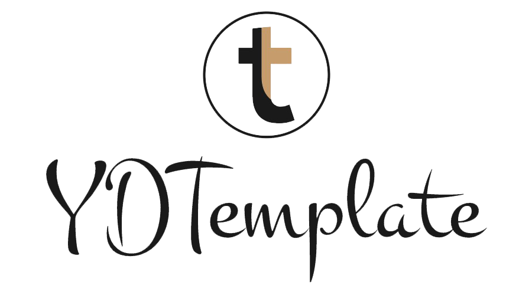

<p align="center">
    
    <p align="center">
        <a href="https://travis-ci.org/l-hammer/YDTemplate" target="_blank"></a>
        <a href="https://github.com/l-hammer/YDTemplate/issues"></a>
        
        <a href="https://github.com/l-hammer/YDTemplate/blob/master/LICENSE"></a>
        <a href="https://codeclimate.com/github/l-hammer/YDTemplate/maintainability"></a>
    </p>
    <p align="center">
        Yindou Web and App special development template~
        <br>
    </p>
</p>

## Usage

This is a project template for [ydt-cli](https://github.com/l-hammer/YDT-cli). 

```bash
$ npm install -g ydt-cli
$ ydt-cli init YDTemplate my-project
```

## Quick start

Several quick start options are available:

<!-- - Initialize template run: `. init.sh` -->
<!-- - Clone the repo: `https://github.com/l-hammer/YDTemplate.git` -->
- Install dependencies with [npm](https://www.npmjs.com/): `npm install`
- App development run `npm run start`
- App development use mock data run `npm run dev`
- Web development run `npm run start:web`
- Web development use mock data run `npm run dev:web`
- Open web example run `npm run dev:webeg`
- Open app example run `npm run dev:appeg`
- Build run `bash build.sh @param1 @param2` (@param1:`web`,`app`,`webeg`,`appeg`; @param2:`--no-minify`)
- Move useless codes run `python bin/mvuseless.py @param` (@param:`web`,`app`,`examples`)
- Open `http://localhost:1234` in your browser.

## What's included

```
YDTemplate/
├── bin/    // python脚本
│   ├── autocopy.py    // 🚚自动拷贝上线代码
│   └── mvuseless.py    // 🔥删除开发非相关代码for强迫症用户
├── configs/
│   ├── meta.js    // 🛠模板配置文件for ydt-cli
│   └── init.ini    // 🎉build配置文件
├── mock/
│   ├── index.js    // 🗳mock server
│   ├── data.json    // 🗄mock data
│   └── util.js    // 🤡mock API
├── server/
│   └── index.js    // 💡node proxy
├── src/
│   ├── api/
│   │   ├── config.js    // 🛠axios配置
│   │   └── index.js    // 🎲业务API
│   ├── assets/
│   │   ├── normalize/
│   │   │   └── index.scss    // 🤖统一浏览器默认样式
│   │   ├── basics/
│   │   │   └── index.scss    // 🙌base.scss
│   │   ├── iconfonts/
│   │   │   └── index.scss    // 🔄内联字体&&字体图标
│   │   ├── animation/
│   │   │   └── index.scss    // 🚥常用css动画
│   │   ├── mixins/
│   │   │   └── index.scss    // 📚可重用的代码块@mixin
│   │   ├── customs/
│   │   │   └── app.scss    // 💋自定义SCSS变量
│   │   └── components/
│   │       └── index.scss    // 🎈常用组件样式@dialog @progress @records page @onepx-border
│   │   ├── app.scss    // app开发样式入口
│   │   └── web.scss    // web开发样式入口
│   ├── examples/
│   │   ├── web/    // web examples
│   │   └── app/    // app examples
│   ├── components/    // 💄常用UI组件(App)
│   │   ├── icon/    // 图标
│   │   ├── loading-bar/    // 进度条
│   │   └── dialog/    // 对话框
│   ├── app/    // SPA
│   │   ├── template/
│   │   │   └── index.tpl    // build中间模板
│   │   ├── mixins/    // 混入
│   │   │   └── index.js    // 功能复用模块
│   │   ├── views/    // page
│   │   │   ├── index.vue    // 首页
│   │   │   └── xxx.vue    // 其它页
│   │   ├── App.vue    // 根组件
│   │   ├── index.html    // app 根页面
│   │   ├── bus.js    // 事件总线，非父子间通信
│   │   ├── main.js    // 入口文件
│   │   ├── router.js    // 配置路由
│   │   └── template.tpl    // 上线模板
│   │── web/
│   │   ├── index.html    // web开发页
│   │   ├── index.js    // web开发脚本
│   │   └── template.tpl    // web上线模板
│   │── vetar/    // 🤞极简版MVVM
│   │   ├── dep.js    // 观察指挥中心
│   │   ├── index.js    // MVVM:Vetar
│   │   └── watcher.js    // 订阅者
│   └── utils/    // 🗃常用工具函数
│       ├── arrayPull.js    // 删除数组指定值
│       ├── cookie.js    // cookie
│       ├── clone.js    // 拷贝（Object, Array or Primitive）
│       ├── date.js    // 解析日期、日期格式化
│       ├── deepClone.js    // 深拷贝 (Object, Array, RegExp, Date or Primitives)
│       ├── distinctValuesOfArray.js    // 数组去重
│       ├── fetch.js    // ajax
│       ├── initArrayWithRange.js    // 初始化指定范围内的数组
│       ├── preloadimages.js    // 图片预加载
│       ├── scrollToTop.js    // 返回顶部
│       ├── shuffleArray.js    // 随机排列数组
│       ├── store.js    // localStorage
│       ├── viewType.js    // 判断数据类型
│       └── wxShare.tpl    // 微信分享
├── clearcache.sh    // ♻️清除缓冲
├── build.sh    // 📦打包
├── init.sh    // 🎉初始化项目
└── push.sh    // 🔥强烈建议使用此脚本替换git push
```
## Technology

- App `Vue 2.x` + `Axios`
- Web `jQuery` + `Handlebars`

## Browser Support

```
last 10 versions
IE 8
iOS 7
```

## Contributing 

- :fork_and_knife:Fork it!
- :twisted_rightwards_arrows:Create your branch: `git checkout -b new-branch`
- :wrench:Make your changes
- :memo:Commit your changes: `git commit -am 'Add some feature'`
- :rocket:Push to the branch: `git push origin new-branch`
- :tada:Submit a pull request

## License

[MIT](https://github.com/l-hammer/YDTemplate/blob/master/LICENSE) © 2018 LHammer

[](https://app.fossa.io/projects/git%2Bgithub.com%2Fl-hammer%2FYDTemplate?ref=badge_large)