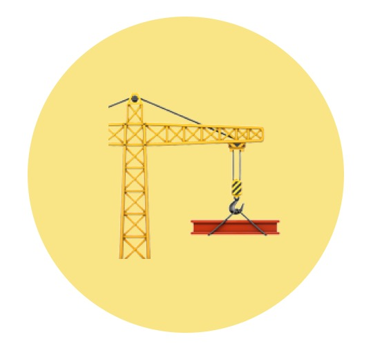

<br><br>
<p align="center">
  	<a href="https://getbootstrap.com/">
        
  	</a>
	<h3 align="center">YDTemplate</h3>
	<p align="center">
		
		
		
	</p>
	<p align="center">
		Yindou Web and App special development template~
		<br>
	</p>
</p>

## Quick start

Several quick start options are available:

- Clone the repo: `https://github.com/l-hammer/YDTemplate.git`
- Install dependencies with [npm](https://www.npmjs.com/): `npm install`
- Web development Run ~~`npm run webdev`~~ `npm run webstart`
- App development Run ~~`npm run appdev`~~ `npm run appstart`
- Open web example Run ~~`npm run webegdev`~~ `npm run webegstart`
- Open app example Run ~~`npm run appegdev`~~ `npm run appegstart`
- Build Run `bash build.sh @param1 @param2` (@param1:`web`,`app`,`webeg`,`appeg`; @param2:`--no-minify`)
- Move useless codes Run `python bin/mvuseless.py @param` (@param:`web`,`app`,`examples`)
- Open `http://localhost:1234` in your browser.

## What's included

```
YDTemplate/
├── bin/    // python脚本
│   ├── autocopy.py    // 🚚自动拷贝上线代码
│   └── mvuseless.py    // 🚚删除开发非相关代码for强迫症用户
├── server/
│   └── index.js    // 💡node proxy
├── src/
│   ├── assets/
│   │   ├── normalize/
│   │   │   └── index.scss    // 统一浏览器默认样式
│   │   ├── iconfonts/
│   │   │   └── index.scss    // 内联字体&&字体图标
│   │   ├── animation/
│   │   │   └── index.scss    // 常用css动画
│   │   ├── mixins/
│   │   │   └── index.scss    // 可重用的代码块@mixin
│   │   ├── components/
│   │   │   └── index.scss    // 常用组件样式@dialog
│   │   ├── app.scss    // app开发样式入口
│   │   └── web.scss    // web开发样式入口
│   ├── examples/
│   │   ├── web/    // web examples
│   │   ├── app/    // app examples
│   ├── app/
│   │   ├── index.html    // app开发页
│   │   ├── index.js    // app开发脚本
│   │   └──template.tpl    // 上线模板
│   └── web/
│       ├── index.html    // web开发页
│       ├── index.js    // web开发脚本
│       └──template.tpl    // web上线模板
├── clearcache.sh    // ♻️清除缓冲
├── build.sh    // 📦打包
└── push.sh    // 🔥强烈建议使用此脚本替换git push
```
## Technology

- App `Vue 2.x` + `Axios`
- Web `Jquery`

## Browser Support

```
last 10 versions
IE 8
iOS 7
```

## Contributing

- Fork it!
- Create your branch: `git checkout -b new-branch`
- Commit your changes: `git commit -am 'Add some feature'`
- Push to the branch: `git push origin new-branch`
- Submit a pull request
